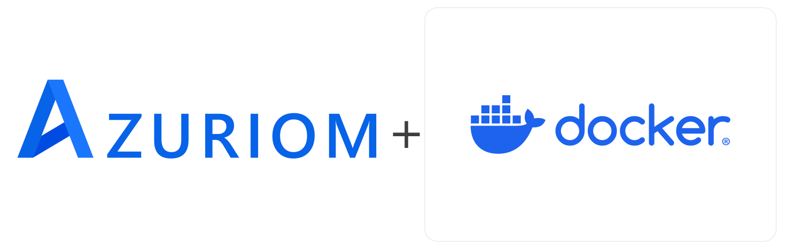

# Azuriom (Dockerified)

**Azuriom** is a complete open-source web solution for game servers. Enjoy dozens of extensions for endless possibilities. Already trusted by over **1,800 servers**, cumulating more than two **millions users**.

## About

This project dockerizes **Azuriom** to facilitate easy deployment and scalability. Using Docker, you can quickly spin up an Azuriom instance, making it easier than ever to manage your server's web presence.

We are not affiliated with Azuriom; this project is a community-driven initiative for streamlined deployment.

## Getting Started

### Prerequisites

Ensure you have [Portainer](https://www.portainer.io/) installed on your machine to manage Docker containers efficiently.

(Optional) We strongly recommend the usage of [Nginx Proxy Manager](https://nginxproxymanager.com/) to facilitate the routing of your DNS.

### Installation

1. Open Portainer and add a new container.
2. Set the image to `ghcr.io/furryplayplace/azurium:latest`.
3. Configure any necessary environment variables directly in Portainer if custom settings are needed.
4. Deploy the container.
5. Access the Azuriom web interface in your browser at `http://YOUR_IP:8000` (or your specified port).

## Licenses

Azurium is licensed under the [GNU General Public License v3.0](src/LICENSE)
As this repository is under the [MIT License](LICENSE)
